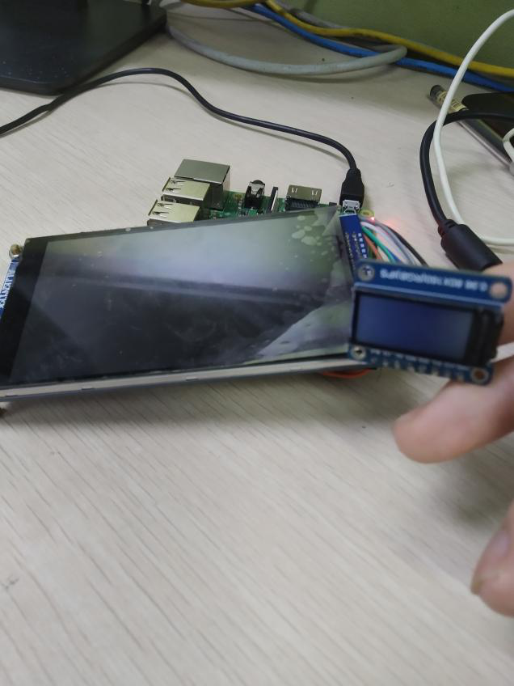
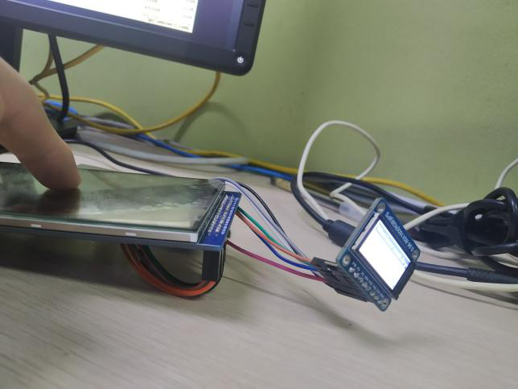

### 构建方法
#### 安装交叉编译器
```
sudo apt install gcc-arm-linux-gnueabihf
```
#### 编译&安装wiringPi
```
cd wiringPi
arm-linux-gnueabihf-gcc -c -Wall *.c
arm-linux-gnueabihf-ar  rcs libmygpio.a  *.o
sudo cp *.h  /usr/local/include
sudo cp libmygpio.a  /usr/local/lib
```
#### 编译&安装FreeRTOS
```
cd FreeRTOS
cd c
arm-linux-gnueabihf-gcc   -I ../h   -Wall   -c *.c
arm-linux-gnueabihf-ar  rcs libfreertos.a  *.o
sudo cp libfreertos.a  /usr/local/lib
cd h
sudo cp *.h  /usr/local/include
```
#### 编译&安装minigui5.0
```
cd minigui
```
```
./autogen.sh
```
```
CC=arm-linux-gnueabihf-gcc \
AR=arm-linux-gnueabihf-ar \
CFLAGS="-lfreertos  -I /usr/local/include" \
./configure \
--host=x86_64-pc-linux-gnu \
--build=armv7l-unknown-linux-gnueabihf \
--target=armv7l-unknown-linux-gnueabihf \
--disable-shared                           \
--enable-static                            \
--with-osname=freertos                        \
--with-targetname=external                 \
--with-runmode=sa                          \
--disable-videodummy                       \
--disable-videopcxvfb                      \
--disable-videoqvfb                        \
--disable-videodrm                         \
--disable-videofbcon                       \
--enable-videocommlcd                      \
--disable-dummyial                         \
--disable-consoleial                       \
--disable-libinputial                      \
--enable-commial                           \
--disable-consoleimps2                     \
--disable-mousecalibrate                   \
--enable-incoreres                         \
--enable-cursor                            \
--disable-clipboard                        \
--disable-adv2dapi                         \
--disable-aboutdlg                         \
--enable-savebitmap                       \
--disable-savescreen                       \
--disable-dblclk                           \
--disable-splash                           \
--disable-latin9support                    \
--disable-gbsupport                        \
--disable-gbksupport                       \
--disable-fullunicode                      \
--disable-rbfsupport                       \
--disable-vbfsupport                       \
--disable-upfsupport                       \
--disable-qpfsupport                       \
--disable-ttfsupport                       \
--disable-complexscripts                   \
--disable-rbfvgaoem                        \
--disable-rbfterminal                      \
--disable-rbffixedsys                      \
--disable-fontsserif                       \
--disable-fontcourier                      \
--disable-fontsystem                       \
--disable-fonttimes                        \
--disable-ttfcache                         \
--with-ttfcachenum=16                      \
--with-ttfcachesize=64                     \
--disable-bmpfsupport                      \
--disable-jpgsupport                       \
--disable-pngsupport                       \
--disable-gifsupport                       \
--disable-flatlf                           \
--disable-skinlf                           \
--disable-ctrlsledit                       \
--disable-ctrlnewtextedit                  \
--disable-ctrllistbox                      \
--disable-ctrlpgbar                        \
--disable-ctrlcombobox                     \
--disable-ctrlpropsheet                    \
--disable-ctrlnewtoolbar                   \
--disable-ctrlmenubtn                      \
--disable-ctrlspinbox                      \
--disable-ctrllistview                     \
--disable-ctrlanimation                    \
--disable-updateregion                     \
--disable-textmode                         \
--disable-shmopen
```
```
make  -j`getconf _NPROCESSORS_ONLN`;sudo make  install
```
#### 编译mg-tests&查看演示效果
```
cd mg-tests
```
```
./autogen.sh
```
```
CC=arm-linux-gnueabihf-gcc \
AR=arm-linux-gnueabihf-ar \
CFLAGS="-lmygpio -I /usr/local/include" \
./configure \
--host=x86_64-pc-linux-gnu \
--build=armv7l-unknown-linux-gnueabihf \
--target=armv7l-unknown-linux-gnueabihf \
--disable-shared                           \
--enable-static
```
```
make -j`getconf _NPROCESSORS_ONLN`;cd comm-engines;./comm-engines
```




### 作者
https://github.com/ehello
邮箱：1062347630@qq.com